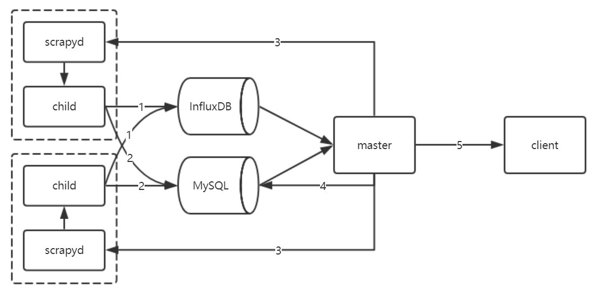
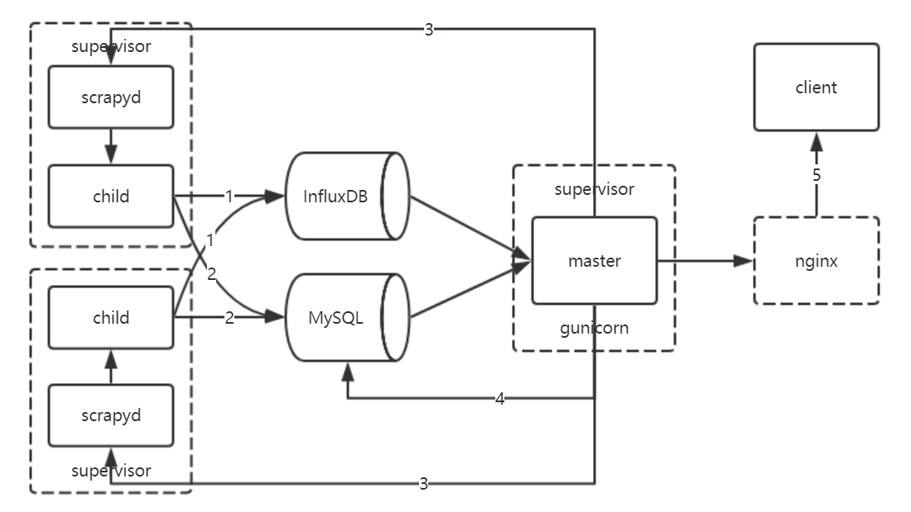
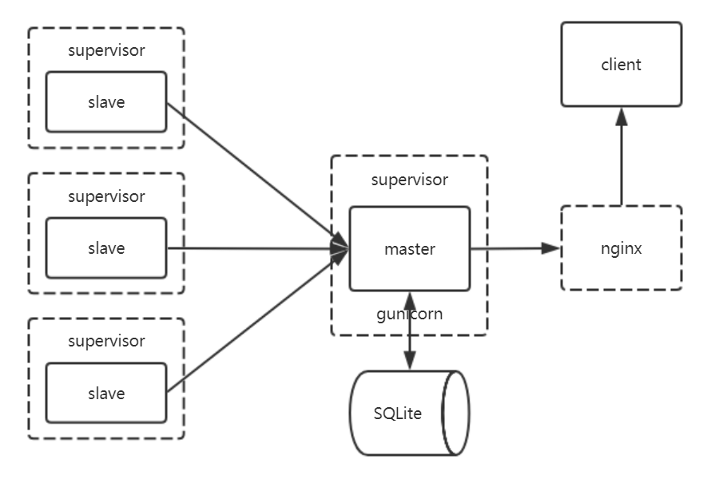
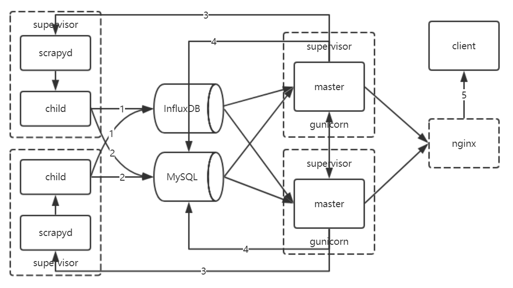
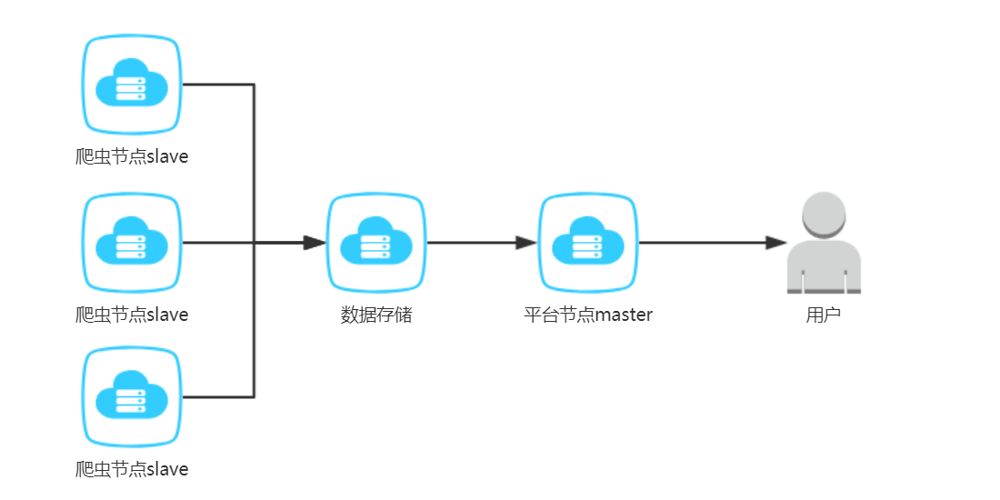
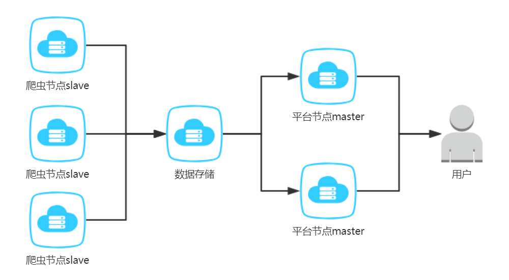
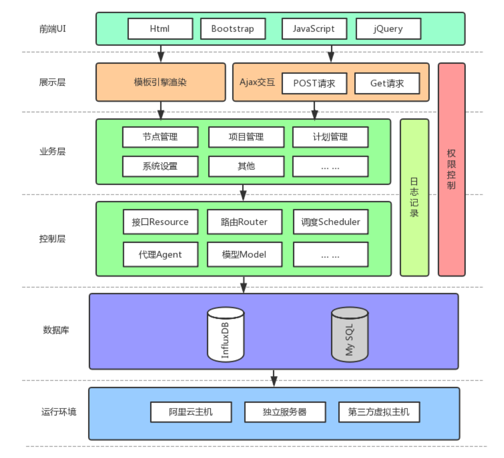

# spider_platform
Scrapyd-based deployment scheduling monitoring platform  
基于Scrapyd的部署/调度/监控平台，支持Scrapy爬虫，Python版本3.6

## 背景及目的
当前爬虫存在以下问题：
1. 代码实现风格未统一，以致非本人维护成本极高
2. 部署繁琐且安全性差（各自通过登陆服务器拉取代码部署/更新）
3. 调度方式多样，维护性差（corntab调度、爬虫内部自调度等）
4. 无有效的规范的异常监控报警机制

为解决上述问题，故设计开发爬虫平台
1. 爬虫实现统一采用Scrapy框架，且通过redis实现分布式扩展
2. 平台通过上传爬虫egg包进行部署更新
3. 平台通过后台程序基于Scrapyd API进行爬虫调度，支持corn语法
4. 平台实时收集节点指标/爬虫异常等，通过Email报警

## 设计图及部署拓扑图
### 设计图V1.0

1. 子节点服务  
    采集本节点系统指标（cpu/内存/网速等）存入InfluxDB
2. 子节点服务  
    采集本节点Scrapyd爬虫日志存入MySQL  
    采集本节点Scrapyd爬虫状态存入MySQL
3. 主节点服务  
    向各节点Scrapyd发送心跳检测指令，检查各节点Scrapyd是否存活  
    将爬虫egg部署至各存活节点的Scrapyd  
    根据调度计划向特定节点的Scrapyd（负载均衡）发送指令进行调度（待优化）
4. 主节点服务  
    根据InfluxDB各节点指标数据及其阈值得出相应节点异常存入MySQL  
    将主节点平台系统异常存入MySQL
5. 主节点服务  
    将各类异常报警至相应人员
### 设计图V1.1

在版本1.0的基础上，实现进程高可用
1. 使用supervisor对child/scrapyd/master进行进程守护
2. 使用nginx+gunicorn管理主节点master的web服务
3. 增加用户模块，含登录/管理等
### 设计图V1.2(当前版本)

在版本1.1的基础上，实现主从松耦合
1. 基于scrapyd重构slave，含原scrapyd及child功能
2. 将原child监控功能移至master，增加节点详情及项目详情页面等
3. 移除对MySQL及InfluxDB的依赖，改用SQLite
### 设计图V1.x

在当前版本的基础上，实现节点高可用
1. 主节点master双主/主备模式
### 网络拓扑图V1.1（当前版本）

1. 部署均在阿里云ESC上进行
2. ‘数据存储’ESC上安装MySQL、InfluxDB、Redis等数据库
3. 至少需要4台ECS安装部署：爬虫节点slave * 2 + 数据存储 * 1+ 平台节点master * 1
### 网络拓扑图V1.x

1. 主节点高可用实现原计划使用Keepalived+Nginx实现，但因后台调度程序重复调用的原因，暂搁置。后续可能对调度程序拆分处理。

## 程序设计
Python技术栈：flask+apscheduler+psutil+sqlalchemy  
数据库技术栈：InfluxDB+MySQL+SQLite  
其他技术栈：Bootstrap+JQuery
###架构设计图（master）

###目录结构
```
daemon/            # 程序配置，如scrapyd/supervisor/nginx等
master/            # 主节点程序
    resources/     # 接口目录，预留
    routers/       # 路由（后端）目录
    scripts/       # 执行目录
    static/        # JS/CSS目录
    templates/     # 页面（前端）目录，Jinja2模板
    __init__.py    # 
    agents.py      # 代理模块
    app.py         # app初始化模块
    config.py      # 配置模块
    extensions.py  # 扩展模块
    models.py      # 模型模块
    schedulers.py  # 调度模块
    settings.py    # 配置文件
    utils.py       # 工具类模块
slave/             # 子节点程序
    scripts/       # 执行目录
    tests/         # 测试目录
    __init__.py    # 
    app.py         # app初始化模块
    config.py      # 配置模块
    decorators.py  # 装饰器模块
    default.conf   # 默认配置
    implementations.py  # 实现模块
    interfaces.py   # 接口模块
    launcher.py     # 调度模块
    runner.py       # 爬虫运行模块
    script.py       # 执行模块
    sqlite.py       # SQLite模块
    txapp.py        # 执行文件
    utils.py        # 工具类模块
    VERSION         # 版本文件
    webservice.py   # WEB API模块
    website.py      # WEB 页面模块
requirements.txt    # 依赖包安装文件
run_master.py       # 主节点master运行文件
run_slave.py        # 子节点slave运行文件
```

### 更新记录
#### v1.1
master:
* 增加用户模块，含登录/管理等

other:
* 使用supervisor守护进程，增加其高可用  
* 使用nginx + gunicorn管理主节点master的web服务  

#### v1.2
slave:
* 基于scrapyd重构slave，含原scrapyd及child功能
* 增加爬虫异常检索、节点性能指标接口

master:
* 拆分Jinja2模板中的JS代码
* 增加节点详情及项目详情页面
* 支持项目多版本选择
* 增加爬虫状态监控
* 增加节点性能指标异常监控
* 增加爬虫统计指标
* 暂时移除节点性能图表，暂仅展示当前性能指标
* 移除对MySQL及InfluxDB的依赖，改用SQLite


### 更新计划
重构后台调度模块(apscheduler至celery)  